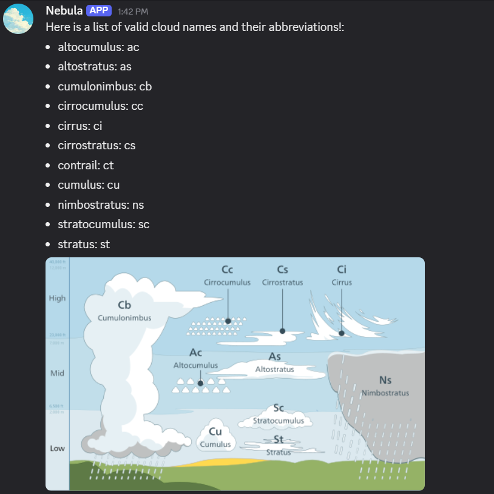
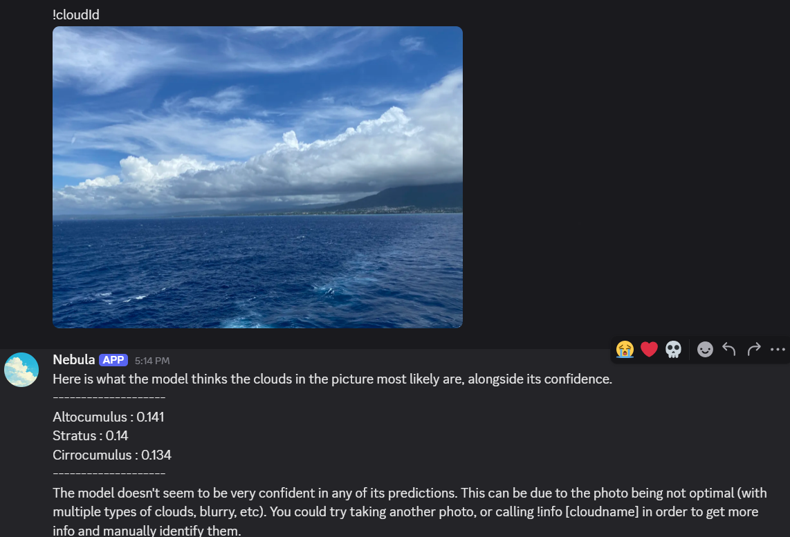
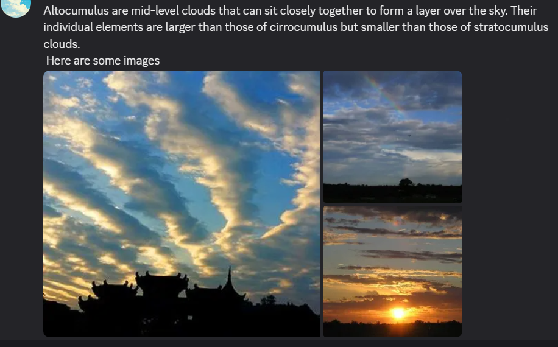

# Quick demo:
Join this discord server https://discord.gg/Gaf5Jv3tT8

# Usage if running bot from code:
1. Run pip install -r requirements.txt
- If you want to train the models, run pip install -r training_requirements.txt
2. Create a .env file  with
- bot_key : discord bot key
3. Run python main.py
4. Follow discord's instructions to generate the invite link to invite the bot to server

# To add the bot to your server:
1. Visit this (link)[https://discord.com/oauth2/authorize?client_id=1394383883176247386&permissions=274878024704&integration_type=0&scope=bot] in your browser
2. Follow discord's instructions to select server you want to add it to
3. Enjoy identifying clouds!

# How to use this bot:
Call !help for instructions 
Call !cloudId to identify clouds
This will return a list of the clouds that the model thinks it is. Try to get only one cloud in each picture, and not crop it weirdly (try to keep it roughly square ish). 
!info \[cloudname\] will give more info on the clouds. !cloudnames will give a list of valid cloudnames

# Demo screenshots

At first glance, this one might not look stratus, but the more I think about it, the more I believe this is a side view of a stratus cloud. It was raining on the island before.

# Credits
Dataset used to train: https://www.kaggle.com/datasets/mmichelli/cirrus-cumulus-stratus-nimbus-ccsn-database
Image used for the discord bot's pfp: https://stock.adobe.com/search/video?k=anime+clouds&asset_id=1107084586
Image of clouds and their altitudes: Wikipedia

# Other notes:
Clouds are also pretty hard to classify, to the point that even I sometimes can't tell them apart. There's a lot of variation between them (definitely not making excuses for my inability to train a CNN), and also doesn't help that there are typically multiple clouds in a picture. I spent a LOT of unlogged time on colab trying to train it. While the model I am using right now is not perfect, it's some sense of direction to allow users to try and ask it about the cloud types the model thinks it is and identify the clouds themselves.

I also removed cirrostratus clouds from the classifier due to their appearance making them difficult for the model to learn.
